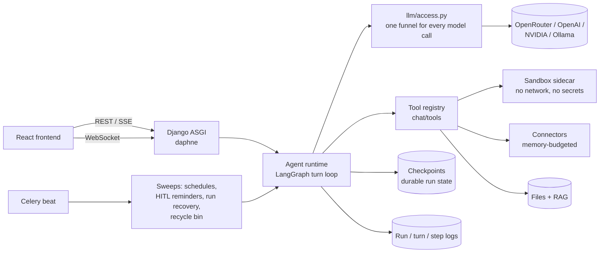

# AIAAS Backend

[](https://github.com/KaushalJainAI/AIAAS_Backend/actions/workflows/tests.yml)

The backend for **AIAAS**, a platform for building AI agents that do real work
on a user's behalf: read and triage a mailbox, research a question, analyse a
spreadsheet in a sandbox, run on a schedule, and **stop to ask a human** before
anything irreversible happens.

Django (ASGI) + LangGraph + Celery + Redis, with the frontend in
[`workflow_assistant`](https://github.com/KaushalJainAI/workflow_assistant).

> **Engineering write-up:** [`docs/ENGINEERING_DECISIONS.md`](docs/ENGINEERING_DECISIONS.md)
> covers the hard problems (memory limits, human approval, long-context agents,
> scaling limits) and why each was solved the way it was.

---

## What it does

| Capability | How |
|---|---|
| **Chat assistant** | Streaming tool-calling agent: web search, knowledge-base search, Python sandbox, charts, files, connected apps |
| **Agents** | An agent is a *configuration* (prompt, model, granted tools, guardrails), not code. Built in a UI, from a template, or by describing it in chat |
| **Human in the loop** | Five autonomy levels (`plan → review → ask → auto → full`). Sensitive calls pause the run; the user approves once, for the session, or always, from chat or an Inbox |
| **Schedules & webhooks** | Cron schedules evaluated in the user's timezone (DST handled), webhook triggers, overlap policies |
| **Delegation** | An agent can fan work out to other agents, bounded by depth, budget and result size |
| **Connected apps** | Gmail, Drive, Sheets, Calendar and MCP servers, with credentials AES-encrypted at rest and injected at call time |
| **Knowledge & files** | Per-user file system, hierarchical RAG, document extraction |
| **Observability** | Every run is recorded as run → turn (with full model reasoning) → tool step, pinned to the agent revision it ran under |
| **Evaluation** | Test suites with graders, plus human review that measures how often the graders were right |

## Architecture



**One door for every run.** Chat, API calls, schedules and delegation all start
runs through `agents/agent/runtime.py::run_agent`. Callers differ in
configuration, never in code path, so a guardrail can't be skipped by starting
a run a different way.

**One funnel for every model call.** `llm/access.py` resolves credentials,
falls back to the platform key, enforces credits, clamps context to the model's
window, and classifies provider errors (so an empty balance becomes an
immediate error, not a spinner followed by an apology).

## Run it locally

```bash
python -m venv venv
source venv/Scripts/activate        # Windows; use venv/bin/activate elsewhere
pip install -r requirements.txt     # requirements-linux.txt on Linux/macOS
cp .env.local .env                  # then set OPENROUTER_API_KEY
python manage.py migrate
python manage.py runserver 0.0.0.0:8000
```

Redis and Celery are optional in development: every background sweep is also a
management command (`run_due_triggers`, `send_hitl_reminders`, `recover_runs`,
`purge_recycle_bin`).

## Tests

```bash
python -m pytest            # ~2,300 tests, no network, Redis or database server needed
```

Tests live in `<app>/tests/`. Several are end-to-end: they drive the real
LangGraph graph against a stub provider and assert on what a client actually
receives. That's how a feature that passed every unit test but reached no user
was caught.

## Operations

| Concern | Where |
|---|---|
| Error reporting | Sentry, enabled by `SENTRY_DSN` (`workflow_backend/observability.py`) |
| Backups | `python manage.py backup_db --keep 7`: consistent online snapshot, gzip, optional S3 upload via `BACKUP_S3_BUCKET` |
| Health check | `GET /api/health/` |
| Crashed runs | `recover_runs` resumes or closes runs orphaned by a restart |
| Cost control | Per-user credits on the platform key (`llm/credits.py`); per-agent monthly spend caps |

## Project layout

| App | Responsibility |
|---|---|
| `agents/` | Agents, runtime, delegation, schedules, HITL, templates, publishing (Django label `orchestrator`) |
| `chat/` | Chat turn pipeline, tool registry, steering, context curation, vision |
| `llm/` | Provider handlers, model catalogue, credits, effort levels, context budget |
| `mcp_integration/` | Connector client, memory supervisor, tool catalogue cache |
| `credentials/` | Encrypted credential vault and OAuth refresh |
| `inference/` | File system, RAG, extraction, recycle bin |
| `logs/` | Run → turn → step observability, agent revisions |
| `eval/` | Graders, suites, sweeps, human review |
| `notifications/` | Notifications and the HITL reminder ladder |
| `sandbox/` + `sandbox_service/` | Python execution in a hardened sidecar container |

Detailed design docs are in [`docs/`](docs/). Start with
[`API.md`](docs/API.md) (every route), [`CONTEXT_LIFECYCLE.md`](docs/CONTEXT_LIFECYCLE.md),
[`AGENT_OBSERVABILITY.md`](docs/AGENT_OBSERVABILITY.md),
[`SANDBOX_EXECUTION.md`](docs/SANDBOX_EXECUTION.md) and
[`EVALUATION.md`](docs/EVALUATION.md).
