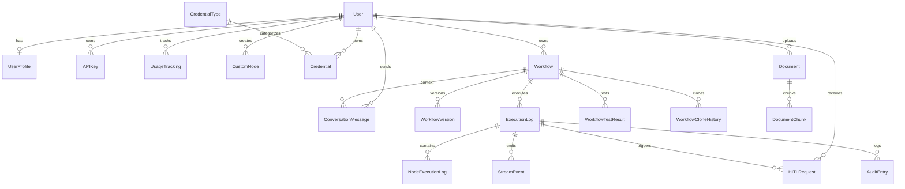

# Database Schema Documentation

> Auto-generated schema for Workflow Automation Backend

---

## Entity Relationship Diagram

---

## Models by App

### 👤 core

| Model | Description |
|-------|-------------|
| **UserProfile** | Extended user data with tier, limits, credits |
| **APIKey** | Programmatic access keys with rotation |
| **UsageTracking** | Daily usage metrics per user |

### 🧩 nodes

| Model | Description |
|-------|-------------|
| **CustomNode** | User-created custom node handlers |

### 🔐 credentials

| Model | Description |
|-------|-------------|
| **CredentialType** | Integration types (OAuth, API Key, etc.) |
| **Credential** | Encrypted user credentials |
| **CredentialAuditLog** | Audit log for credential access/usage |

### 📋 logs

| Model | Description |
|-------|-------------|
| **ExecutionLog** | Workflow execution records |
| **NodeExecutionLog** | Per-node execution details |
| **AuditEntry** | HITL decisions and sensitive actions |
| **ValidationFailureLog** | Logs for validation failures |

### 🤖 orchestrator

| Model | Description |
|-------|-------------|
| **Workflow** | User workflow definitions |
| **WorkflowVersion** | Version history snapshots |
| **HITLRequest** | Human-in-the-loop requests |
| **ConversationMessage** | AI chat history |
| **WorkflowTestResult** | Results of async workflow testing |
| **WorkflowCloneHistory** | Tracks lineage of workflow creation |

### 🧠 inference

| Model | Description |
|-------|-------------|
| **Document** | Uploaded files for RAG |
| **DocumentChunk** | Chunked text with embeddings |

### 📡 streaming

| Model | Description |
|-------|-------------|
| **StreamEvent** | Persisted SSE/WebSocket events |

---

## Field Details

### UserProfile
| Field | Type | Description |
|-------|------|-------------|
| user | FK(User) | OneToOne link |
| tier | CharField | free/pro/enterprise |
| compile_limit | IntegerField | Rate limit per minute |
| execute_limit | IntegerField | Rate limit per minute |
| stream_connections | IntegerField | Max concurrent streams |
| credits_remaining | IntegerField | Available credits |
| credits_used_total | IntegerField | Historical usage |

### APIKey
| Field | Type | Description |
|-------|------|-------------|
| user | FK(User) | Owner |
| name | CharField | Friendly name |
| key | CharField | Auto-generated, unique |
| key_prefix | CharField | First 8 chars for ID |
| is_active | BooleanField | Active status |
| expires_at | DateTimeField | Optional expiration |
| last_used_at | DateTimeField | Last usage timestamp |

### Workflow
| Field | Type | Description |
|-------|------|-------------|
| user | FK(User) | Owner |
| name | CharField | Display name |
| slug | SlugField | URL-safe identifier |
| nodes | JSONField | Array of node definitions |
| edges | JSONField | Array of connections |
| viewport | JSONField | Canvas state |
| workflow_settings | JSONField | Workflow config |
| status | CharField | draft/active/paused/archived |
| is_template | BooleanField | Template flag |
| execution_count | IntegerField | Total runs |
| is_subworkflow_enabled | BooleanField | Allow use as subworkflow |
| max_nesting_depth | IntegerField | Max recursion depth |
| parent_template | FK(WorkflowTemplate) | Source template |
| modifiable_fields | JSONField | Fields safe to modify |
| is_cloneable | BooleanField | Cloneable flag |
| successful_executions | IntegerField | Count of successes |
| average_duration_ms | IntegerField | Avg duration |

### ExecutionLog
| Field | Type | Description |
|-------|------|-------------|
| execution_id | UUIDField | Unique identifier |
| workflow | FK(Workflow) | Executed workflow |
| user | FK(User) | Executor |
| status | CharField | pending/running/completed/failed |
| trigger_type | CharField | manual/schedule/webhook/api |
| started_at | DateTimeField | Start time |
| completed_at | DateTimeField | End time |
| duration_ms | IntegerField | Duration in ms |
| input_data | JSONField | Input payload |
| output_data | JSONField | Final output |
| error_message | TextField | Error if failed |
| nodes_executed | IntegerField | Count |
| tokens_used | IntegerField | LLM tokens |
| credits_used | IntegerField | Credits consumed |

### Credential
| Field | Type | Description |
|-------|------|-------------|
| user | FK(User) | Owner |
| credential_type | FK(CredentialType) | Type |
| name | CharField | Friendly name |
| public_metadata | JSONField | Public visibility data |
| encrypted_data | BinaryField | Fernet encrypted |
| access_token | BinaryField | Encrypted OAuth access token |
| refresh_token | BinaryField | Encrypted OAuth refresh token |
| token_expires_at | DateTimeField | Token expiry |
| is_active | BooleanField | Active status |
| is_verified | BooleanField | Verified working |
| last_used_at | DateTimeField | Last usage |
| last_error | TextField | Last error message |

### CredentialType
| Field | Type | Description |
|-------|------|-------------|
| name | CharField | Display name |
| slug | SlugField | Unique ID |
| service_identifier | CharField | Maps to nodeType |
| auth_method | CharField | api_key/oauth2/basic/etc |
| fields_schema | JSONField | JSON schema for fields |
| oauth_config | JSONField | OAuth configuration |

### HITLRequest
| Field | Type | Description |
|-------|------|-------------|
| request_id | UUIDField | Unique identifier |
| execution | FK(ExecutionLog) | Parent execution |
| user | FK(User) | Recipient |
| request_type | CharField | approval/clarification/error_recovery |
| title | CharField | Short title |
| message | TextField | Detailed message |
| options | JSONField | Available choices |
| status | CharField | pending/approved/rejected/timeout |
| response | JSONField | User response |
| timeout_seconds | IntegerField | Timeout config |

### CustomNode
| Field | Type | Description |
|-------|------|-------------|
| user | FK(User) | Creator |
| name | CharField | Display name |
| node_type | CharField | Unique ID |
| category | CharField | Node category |
| code | TextField | Python code |
| fields_schema | JSONField | Config schema |
| input_schema | JSONField | Input schema |
| output_schema | JSONField | Output schema |
| status | CharField | draft/pending/approved/rejected |
| is_validated | BooleanField | Validation status |
| is_public | BooleanField | Public availability |
| version | CharField | Version string |

---

## Statistics

| Metric | Value |
|--------|-------|
| **Total Models** | 20 |
| **Apps with Models** | 7 |
| **Total Fields** | ~160 |
