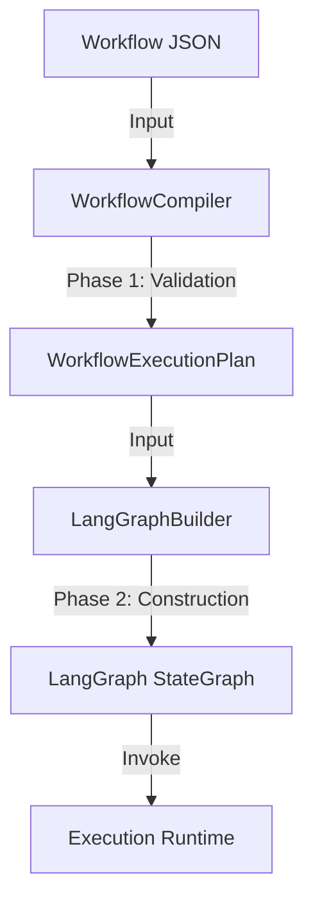

# Workflow Compilation Process

This document details how the backend transforms a user-defined workflow (JSON) into an executable runtime graph (LangGraph).

## Overview

The compilation process consists of two distinct phases:

1.  **Static Compilation (`WorkflowCompiler`)**: Validates the workflow definition and generates a deterministic `WorkflowExecutionPlan`.
2.  **Runtime Construction (`LangGraphBuilder`)**: Converts the execution plan into a `LangGraph.StateGraph` for actual execution.

## Phase 1: Compilation & Validation

**Class:** `compiler.compiler.WorkflowCompiler`

This phase runs before execution starts. It ensures the workflow is structurally sound and secure.

### Steps:

1.  **DAG Validation**:
    *   Checks for cycles (circular dependencies).
    *   Identifies orphaned nodes (nodes with no connections).
    *   Verifies graph connectivity.
2.  **Credential Validation**:
    *   Checks if the user possesses the `credential_id` referenced in any node.
    *   Ensures credentials are valid and active.
3.  **Config Validation**:
    *   Validates that required fields for each specific node type are present in the `data.config` object.
4.  **Plan Generation**:
    *   Performs a **Topological Sort** to determine the correct execution order.
    *   Identifies **Entry Points** (nodes with no upstream dependencies, usually Triggers).
    *   Assigns timeouts (node-specific or global default).

**Output**: `WorkflowExecutionPlan` (Pydantic model) containing the sorted nodes, entry points, and dependencies.

## Phase 2: Graph Construction

**Class:** `compiler.langgraph_builder.LangGraphBuilder`

This phase occurs right before execution. It maps the static plan to dynamic Python functions.

### Architecture:

*   **State**: A typed `WorkflowState` dictionary matches the execution context (variables, outputs, current node, status).
*   **Nodes**: Each step in the plan is wrapped in an asynchronous `node_function` that:
    1.  Resolves the node handler from the `NodeRegistry`.
    2.  Builds the `ExecutionContext` with isolated data.
    3.  Executes the handler within an `asyncio.wait_for` block (enforcing timeouts).
    4.  Updates the shared state with `node_outputs`.

### Edge Routing:

The builder converts abstract edges into LangGraph routing logic:

*   **Standard Edges**: Direct connections (Node A -> Node B).
*   **Conditional Edges** (If/Switch):
    *   Uses `graph.add_conditional_edges`.
    *   A routing function checks the `_handle_{node_id}` output in the state.
    *   If the node output "true", usage flows to the node connected to the "true" handle.

## Example Flow

1.  **User** sends `POST /api/workflows/{id}/compile/`.
2.  **View** loads workflow and user credentials.
3.  **WorkflowCompiler** produces the plan (JSON-serializable).
4.  **Executor** initializes `LangGraphBuilder`.
5.  **LangGraphBuilder** creates the graph objects and returns a compiled `Runnable`.
6.  **Executor** invokes the runnable with the initial state.
