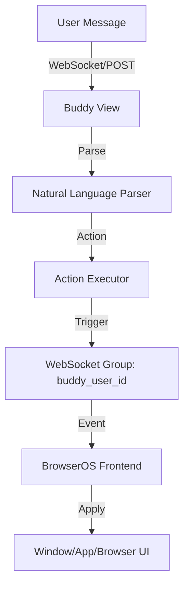

# Buddy AI Assistant

Buddy is the platform's multi-modal help assistant, integrated directly into **BrowserOS** and the **Better n8n** frontend. It acts as a bridge between natural language intent and the system's underlying capabilities (Browser Automation, OS Control, and MCP Tools).

## 1. Technical Overview

Buddy operates as a real-time event dispatcher. When a user interacts with Buddy, the backend processes the command and emits structured actions via **WebSockets (Django Channels)** to the frontend.

## 2. Command Processing Logic

Buddy uses a two-tiered command processing strategy:

### A. Heuristic Parsing (`_parse_text_command`)
Before involving an LLM, Buddy runs a series of regex-based heuristics to handle common OS and Browser commands instantly.
- **Browser Actions**: `navigate`, `click`, `fill`, `screenshot`.
- **OS Actions**: `open app`, `focus window`, `maximize`, `set wallpaper`, `show notification`.

### B. Intent Analysis
If heuristics don't match, Buddy's intent is analyzed by the orchestrator to determine if it should trigger a workflow, search the web, or invoke an MCP tool.

## 3. BrowserOS Integration

Buddy has direct "hooks" into the BrowserOS state:
- **App Aliasing**: Maps natural language names (e.g., "sheets", "calc", "chat") to internal app IDs (`sheets-editor`, `calculator`, `chatbot`).
- **Window Management**: Can programmatically control the `z-index`, `minimized` state, and `position` of any app window in the user's workspace.
- **Context Capture**: The frontend sends "Screen Context" (snapshot of open windows and browser state) to the `process_context` endpoint, which Buddy stores in the user's `OSWorkspace` for future reasoning.

## 4. MCP & Browser Automation

Buddy is a primary consumer of **Puppeteer-based MCP tools**.
- **Tool Mapping**: When a user says "Navigate to google.com," Buddy searches for an enabled MCP server providing the `puppeteer_navigate` tool.
- **Credential Injection**: Buddy automatically injects the user's saved credentials into the MCP tool call (e.g., if a browser tool requires a proxy login).

## 5. Real-time Communication

Buddy uses a dedicated Django Channels group `buddy_{user_id}`.
- **`os_open_app`**: Tells the frontend to launch a specific window.
- **`os_notify`**: Displays a system-level toast notification.
- **`browser_action`**: Instructs the browser component to perform a low-level interaction (click, type, etc.).

---

**Source Reference**: [buddy/views.py](file:///c:/Users/91700/Desktop/AIAAS/Backend/buddy/views.py)
