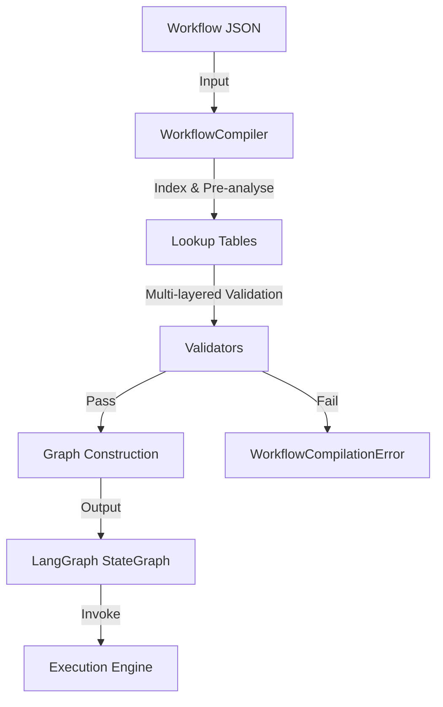

# Workflow Compilation Process

This document details how the AIAAS backend transforms a user-defined workflow (JSON) into an executable runtime graph (**LangGraph**) in a single pass.

## Overview

The compilation process is unified into the `WorkflowCompiler` class. It performs three main duties:
1. **Indexing**: Building fast lookup tables for nodes, labels, and edges.
2. **Validation**: Multi-layered static analysis (DAG, Credentials, Configs, Types).
3. **Graph Construction**: Transforming ReactFlow nodes into LangGraph nodes and edges.

## 1. Indexing & Pre-Analysis
Before any validation runs, the compiler builds several internal maps to optimize performance:
- `_node_map`: Direct `node_id` → node dictionary lookup.
- `_label_to_id`: Maps user-defined labels and node types to their unique IDs.
- `_outgoing`: Pre-mapped adjacency list for fast edge traversal.
- `_node_expression_paths`: Pre-scanned paths for any strings containing `{{ expression }}` logic.
- `_loop_body_sources`: Identifies which nodes are part of a loop's "body" vs. "initial feed" using BFS.

## 2. Multi-Layered Validation
The compiler runs four validation suites. Any "error" level issue halts compilation immediately.

### A. DAG Validation (`validate_dag`)
- Ensures every edge connects two valid nodes.
- Detects illegal cycles. Cycles are **only** permitted if the back-edge target is a recognized `LOOP` or `SPLIT_IN_BATCHES` node.
- Confirms at least one trigger (zero-in-degree) node exists.
- Ensures all nodes are reachable from a trigger (no orphans).

### B. Credential Security (`validate_credentials`)
- Scans all nodes for credential requirements.
- Cross-references the authenticated `User` and their active `Credential` set.
- Rejects the compilation if a node references a credential not owned by the user.

### C. Configuration & Schema (`validate_node_configs`)
- Verifies that a handler exists for every node type.
- Enforces safety limits (e.g., `max_loop_count` between 1 and 1000).
- Delegates to specific node handlers (e.g., `OpenAIHandler`) to validate their unique JSON schema.

### D. Type Compatibility (`validate_type_compatibility`)
- Performs a best-effort static type check between connected nodes.
- Flags mismatches (e.g., trying to feed a `binary` image output into a `json` parser).

## 3. Graph Construction (LangGraph)
Once validated, the compiler builds a `langgraph.graph.StateGraph`.

### Node Creation
Every ReactFlow node is wrapped in an async closure. This wrapper handles:
- **Context Injection**: Instantiates an `ExecutionContext` with local variables and node outputs.
- **Input Resolution**: Resolves the "first item" from upstream dependencies.
- **Orchestrator Hooks**: If `supervision_level` is set, it injects `before_node`, `after_node`, and `on_error` callbacks to the **KingOrchestrator**.
- **Execution**: Dispatches to the actual handler (e.g., `CodeHandler.execute`).

### Edge Wiring
- **Standard Edges**: Wired directly using `graph.add_edge(src, tgt)`.
- **Conditional Edges**: Nodes like `If`, `Switch`, or `Loop` use `graph.add_conditional_edges`. A router function checks the special `_handle_{node_id}` output to decide the next path.
- **Entry Points**: Every trigger node is wired to the global `START` constant.
- **Termination**: Nodes with no outgoing edges are wired to `END`.

## 4. Compilation Output
The result is a `CompiledStateGraph`. This is a stateless, thread-safe "runnable" that can be invoked multiple times with different initial states.

---

**Source Reference**: [compiler.py](file:///c:/Users/91700/Desktop/AIAAS/Backend/compiler/compiler.py)
