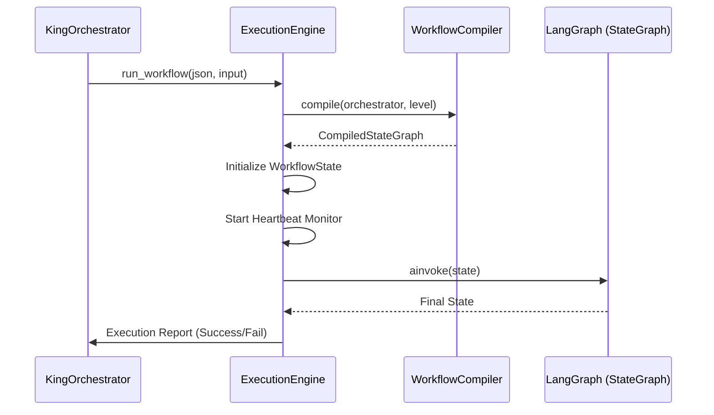

# Workflow Execution Engine

This document describes the runtime execution of workflows within AIAAS, focusing on the `ExecutionEngine` and its interaction with LangGraph.

## Overview

The `ExecutionEngine` is a deterministic runner that consumes a `CompiledStateGraph` and manages its lifecycle. It is decoupled from high-level "Orchestration" (AI reasoning); its only job is to execute the graph and report logs, heartbeats, and outcomes.

## 1. Execution Lifecycle

## 2. State Management (`WorkflowState`)
The engine initializes a standard state dictionary that LangGraph carries through every node:
- `execution_id`: UUID of the current run.
- `node_outputs`: Map of `node_id` → list of output items.
- `variables`: Global workflow variables.
- `loop_stats`: Counter for iterations (prevents infinite loops).
- `status`: One of `running`, `completed`, `failed`, `paused`, `cancelled`.

## 3. Node Execution Flow
For every node in the graph, the engine (via the compiler's closure) performs:
1. **Context Init**: Creates an `ExecutionContext` which resolves `{{ expression }}` strings using the current state.
2. **Input Resolution**: Fetches items from parent nodes (usually the first item's JSON payload).
3. **Pre-Execution Hook**: Calls `orchestrator.before_node()` (if supervision is FULL).
4. **Handler Dispatch**: Executes the specific logic (e.g., Python Code, HTTP Request, LLM Prompt).
5. **Post-Execution Hook**: Calls `orchestrator.after_node()` (if supervision is FULL).
6. **Persistence**: Syncs local changes back to the global `WorkflowState`.

## 4. Error Handling & Supervision
- **Node-Level Failure**: If a handler fails, the engine triggers the `on_error` orchestrator hook. The AI can then decide to `Abort`, `Retry`, or `Pause`.
- **System Crashes**: Any unhandled exceptions in the engine are caught, logged as `failed`, and the execution record is finalized to prevent "zombie" runs.
- **Heartbeats**: While the graph is running, a background task sends a heartbeat every 30 seconds to the database. This allows the system to detect and recover from worker crashes.

## 5. Nesting & Subworkflows
The engine supports recursive execution. A `SubworkflowNode` will call back into the `ExecutionEngine` to run a different workflow, passing its own outputs as input. The engine tracks `nesting_depth` and `workflow_chain` to prevent infinite recursive calls.

---

**Source Reference**: [engine.py](file:///c:/Users/91700/Desktop/AIAAS/Backend/executor/engine.py)
