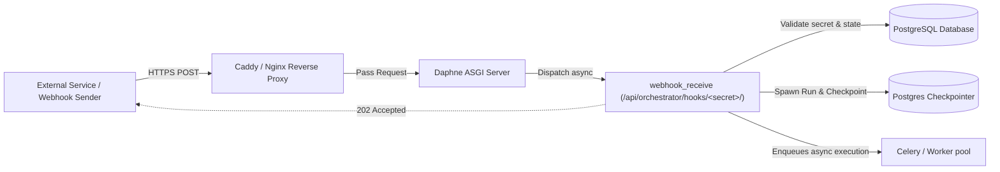

# Production Migration Plan: PostgreSQL & Webhooks Infrastructure

## Executive Summary
This plan covers:
1. **Migrating Production Database from SQLite to PostgreSQL** (application data, Django state, and durable LangGraph agent checkpointers).
2. **Production Webhook Architecture & Deployment** (handling inbound trigger webhooks, reverse proxy routing, SSL/TLS, async ingestion, and concurrency with PostgreSQL).

---

## 1. PostgreSQL Migration Architecture

### Current vs. Target Production State

| Component | Current State | Target Production State |
| :--- | :--- | :--- |
| **Primary Database** | SQLite (`/app/data/db.sqlite3`) | PostgreSQL 16 (Containerized or AWS RDS) |
| **Django DB Driver** | `django.db.backends.sqlite3` | `django.db.backends.postgresql` with `psycopg2-binary` |
| **LangGraph Checkpointer** | SQLite (`checkpoints.sqlite3`) | PostgreSQL (`langgraph-checkpoint-postgres` + `psycopg_pool`) |
| **Concurrency / Locking** | Single file lock (blocks concurrent webhook writes) | Row-level locking (MVCC), non-blocking concurrent triggers |
| **Agent Triggers & Webhooks** | SQLite tables (`Trigger` & `ExecutionLog`) | PostgreSQL indexed tables (`Trigger.secret`, `Trigger.next_due_at`) |

---

## 2. Inbound Webhook Architecture & Integration

In AIAAS, webhooks allow external services (GitHub, Stripe, Telegram, Slack, custom integrations) to trigger sub-agents unattended via:
`POST /api/orchestrator/hooks/<secret>/` ([triggers.py](file:///C:/Users/91700/Desktop/AIAAS/Backend/agents/views/triggers.py#L382-L450)).

### Why PostgreSQL is Critical for Webhooks
- **Eliminating Database Locks**: With SQLite, sudden bursts of inbound webhooks or simultaneous scheduled tasks cause `sqlite3.OperationalError: database is locked`. PostgreSQL handles concurrent requests smoothly using multi-version concurrency control (MVCC).
- **Atomic Trigger Updates**: Webhook hits update `last_fired_at` and `consecutive_failures` via atomic DB operations (`aupdate(consecutive_failures=F('consecutive_failures') + 1)`).
- **Fast Secret Resolution**: Webhook lookups query `Trigger.objects.filter(secret=secret, mode='webhook', enabled=True)`. In PostgreSQL, this leverages the unique B-tree index on `secret` instantly.

### Webhook Production Ingress Design



---

## 3. Step-by-Step Implementation Roadmap

### Phase 1: Environment & Dependency Verification
1. **Python Dependencies**:
   Verify in [requirements-linux.txt](file:///C:/Users/91700/Desktop/AIAAS/Backend/requirements-linux.txt):
   - `psycopg2-binary==2.9.12`
   - `langgraph-checkpoint-postgres==3.1.2`
   - `psycopg-pool`
2. **Environment Variables Configuration** (`.env` in production):
   ```bash
   # Database Configuration
   DB_ENGINE=postgres
   POSTGRES_DB=aiaas
   POSTGRES_USER=aiaas_user
   POSTGRES_PASSWORD=<STRONG_RANDOM_PASSWORD>
   POSTGRES_HOST=db  # service name in docker-compose, or external RDS endpoint
   POSTGRES_PORT=5432
   DB_CONN_MAX_AGE=0  # Prevents thread-pool connection exhaustion under Daphne

   # LangGraph Checkpointer
   AGENT_CHECKPOINTER=postgres
   AGENT_CHECKPOINT_DSN=postgresql://aiaas_user:<STRONG_RANDOM_PASSWORD>@db:5432/aiaas

   # Webhook & Host Ingress
   PUBLIC_URL=https://aiaas.kaushaljain.com
   ALLOWED_HOSTS=aiaas.kaushaljain.com,localhost,backend
   CSRF_TRUSTED_ORIGINS=https://aiaas.kaushaljain.com
   ```

---

### Phase 2: Production Docker & Compose Configuration
Update `docker-compose.prod.yml` (and `docker-compose.ec2.yml`) to ensure PostgreSQL and the reverse proxy correctly route inbound webhooks:

1. **PostgreSQL Service**:
   ```yaml
   db:
     image: postgres:16-alpine
     container_name: aiaas-db
     restart: unless-stopped
     env_file:
       - .env
     command: >
       postgres
       -c shared_buffers=64MB
       -c effective_cache_size=128MB
       -c work_mem=4MB
       -c max_connections=35
     mem_limit: 256m
     volumes:
       - pgdata:/var/lib/postgresql/data
     networks:
       - aiaas-network
     healthcheck:
       test: ["CMD-SHELL", "pg_isready -U $$POSTGRES_USER -d $$POSTGRES_DB"]
       interval: 10s
       timeout: 5s
       retries: 5
   ```

2. **Webhooks Routing via Reverse Proxy (Caddy / Nginx)**:
   Ensure Caddyfile or Nginx passes inbound `/api/orchestrator/hooks/` directly to the Daphne ASGI server with original client IP and HTTPS headers:
   ```caddy
   aiaas.kaushaljain.com {
       # Inbound API & Webhooks
       handle /api/* {
           reverse_proxy backend:8000 {
               header_up X-Forwarded-Proto https
               header_up X-Real-IP {remote_host}
           }
       }
       # Frontend SPA
       handle {
           reverse_proxy frontend:80
       }
   }
   ```

---

### Phase 3: Data Migration (SQLite to PostgreSQL)
If existing data (users, agents, credentials, triggers, webhooks) must be transferred:

1. **Maintenance Mode / Pause Ingestion**:
   ```bash
   docker compose stop backend worker beat
   ```
2. **Export SQLite Data**:
   ```bash
   python manage.py dumpdata \
     --natural-foreign --natural-primary \
     --exclude contenttypes --exclude auth.Permission \
     --indent 2 > datadump.json
   ```
3. **Switch to Postgres & Apply Migrations**:
   Set `DB_ENGINE=postgres` in `.env`, then:
   ```bash
   python manage.py migrate
   ```
4. **Import Data & Reset Sequences**:
   ```bash
   python manage.py loaddata datadump.json
   # Reset PostgreSQL primary key sequences
   python manage.py sqlsequencereset agents credentials chat logs notifications | python manage.py dbshell
   ```

---

### Phase 4: Webhook Verification & Testing

1. **Create / Retrieve a Webhook Trigger**:
   - In the Agent Builder / Triggers UI, add a **Webhook** trigger to an agent with `allow_unattended=True`.
   - Retrieve the public webhook URL:
     `https://aiaas.kaushaljain.com/api/orchestrator/hooks/<secret>/`
2. **Simulate Webhook Payload**:
   ```bash
   curl -X POST https://aiaas.kaushaljain.com/api/orchestrator/hooks/<secret>/ \
        -H "Content-Type: application/json" \
        -d '{"event": "lead_created", "customer_name": "Acme Corp", "priority": "high"}'
   ```
3. **Expected Behavior**:
   - Immediate `202 Accepted` response.
   - Agent execution record created in PostgreSQL (`ExecutionLog`).
   - `Trigger.last_fired_at` timestamp updated in PostgreSQL.
   - Payload injected as context to the agent prompt without blocking the web server.

---

### Phase 5: Monitoring, Concurrency & Security Check
1. **Rate Limiting & Abuse Prevention**:
   - Verify `MAX_WEBHOOK_BODY_BYTES = 64 * 1024` (64KB payload ceiling enforced).
   - Ensure consecutive failures disable the trigger if `allow_unattended` is turned off or spend cap is hit.
2. **DB Connection Pool Monitoring**:
   - Observe Postgres connection count:
     `SELECT count(*) FROM pg_stat_activity;`
3. **Log Rotation**:
   - Ensure Docker JSON log rotation is enabled on the `db` and `backend` containers.
