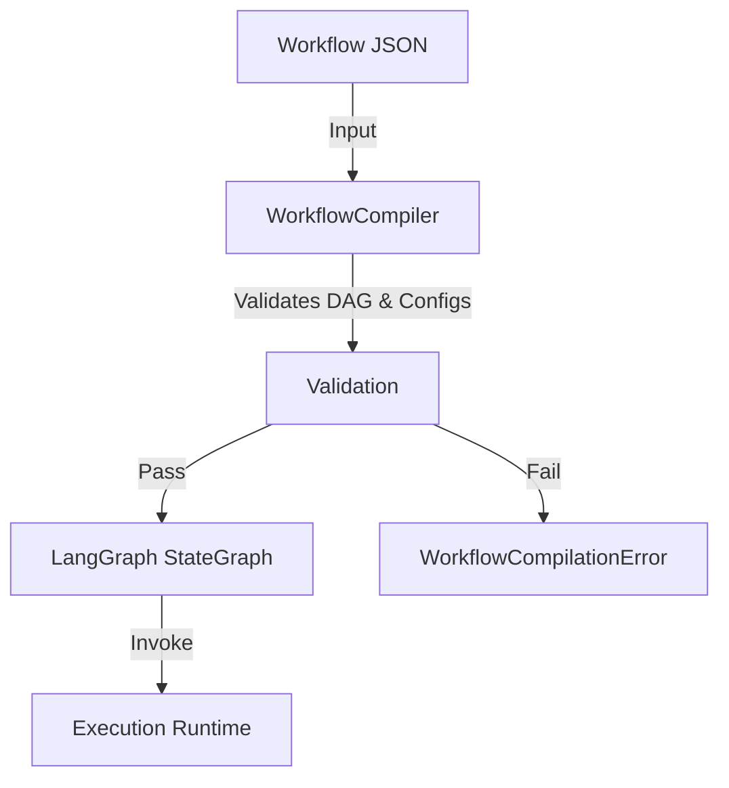

# Workflow Compilation Process

This document details how the backend transforms a user-defined workflow (JSON) into an executable runtime graph (LangGraph) in a single pass.

## Overview

The compilation process is unified into a single class `WorkflowCompiler` that performs validation and graph construction simultaneously to maximize performance.

## Unified Compilation

**Class:** `compiler.compiler.WorkflowCompiler`

This phase runs exactly when execution is requested (or during a dry-run check). It ensures the workflow is structurally sound, secure, and immediately executable.

### Steps:

1.  **Validation Phase**:
    *   **DAG Validation**: Checks for cycles and graph integrity.
    *   **Credential Validation**: Verifies user possesses referenced credentials.
    *   **Config Validation**: Checks node-specific required fields.
    *   **Type Compatibility**: Ensures data types match between connected nodes.
    *   **Fail Fast**: If any validation fails, a `WorkflowCompilationError` is raised immediately.

2.  **Graph Construction Phase**:
    *   **StateDefinition**: Initializes the `WorkflowState` schema (TypedDict).
    *   **Topo Sort**: Determines entry points.
    *   **Node Creation**: Wraps each node handler in an async wrapper that handles:
        *   Context Isolation (`ExecutionContext`)
        *   Input Resolution (from upstream outputs)
        *   Orchestrator Hooks (`before_node`, `after_node`, `on_error`)
        *   Loop Counting (`loop_stats`)
        *   Timeouts
    *   **Edge Creation**:
        *   Maps standard edges directly.
        *   Maps conditional nodes (`if`, `switch`, `loop`) to `add_conditional_edges` with dynamic routing logic based on output handles.

**Output**: An executable `CompiledStateGraph` (LangGraph Runnable).

## Runtime execution

The Orchestrator calls `compiler.compile(orchestrator=self)` to get the graph, then invokes it `await graph.ainvoke(initial_state)`.

### Architecture:

*   **State**: A typed `WorkflowState` dictionary matches the execution context (variables, outputs, current node, status).
*   **Orchestrator Injection**: The compiler injects the running `WorkflowOrchestrator` instance into every node function, allowing for real-time control (Pause/Resume/Cancel) during execution.

## Example Flow

1.  **Orchestrator** receives execute request.
2.  **Orchestrator** instantiates `WorkflowCompiler(json, user_creds)`.
3.  **Compiler** validates and builds the graph in <80ms.
4.  **Orchestrator** invokes the graph directly.
