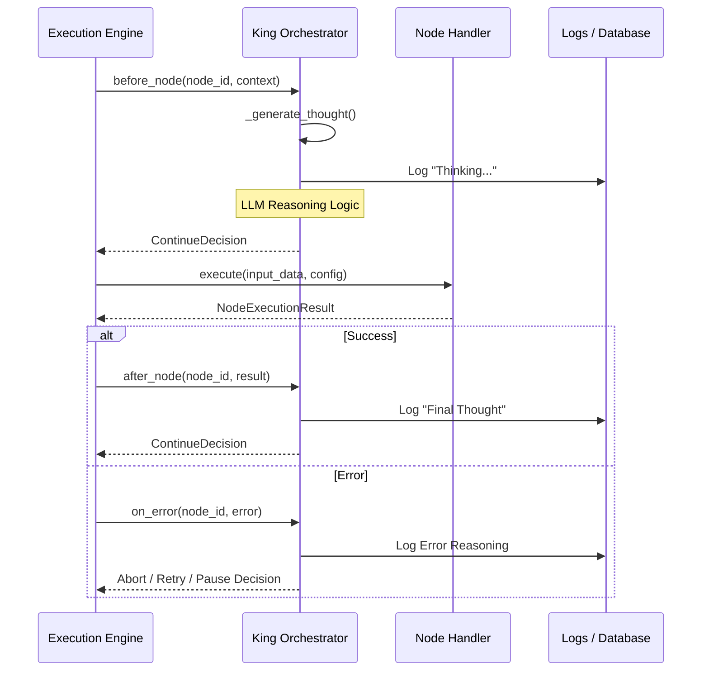

# Supervision Pipeline Documentation

## Overview

The Supervision Pipeline is the core orchestration and oversight mechanism within the AIAAS (AI-as-a-Service) platform. It ensures that workflow executions are not just deterministic but also intelligent, providing a layer of high-level reasoning and human-in-the-loop (HITL) control over the raw execution engine.

The system is built on a "King-Worker" architecture:
- **King Orchestrator**: The "Supreme Manager" that handles reasoning, user intent, and policy enforcement.
- **Execution Engine**: The "Deterministic Worker" that runs the compiled workflow graph using LangGraph.

---

## Architectural Components

### 1. King Orchestrator (`king.py`)
The [KingOrchestrator](file:///c:/Users/91700/Desktop/AIAAS/Backend/executor/king.py) is the primary supervisor. It monitors every step of a workflow and provides "AI Thoughts" for observability.

**Key Responsibilities:**
- **Intent Translation**: Converts natural language requests into executable workflows.
- **Reasoning Generation**: Uses an LLM to generate internal `thinking` and user-facing `thought` blocks for each node execution.
- **Policy Enforcement**: Decides whether to continue, pause, or abort based on node outputs and goal conditions.
- **HITL Management**: Handles requests for human approval, clarification, and error recovery.

### 2. Execution Engine (`engine.py`)
The [ExecutionEngine](file:///c:/Users/91700/Desktop/AIAAS/Backend/executor/engine.py) is responsible for running the workflow graph reliably. It is a "Glass Box" designed for full observability.

**Key Responsibilities:**
- **Graph Compilation**: Uses the `WorkflowCompiler` to turn JSON into a LangGraph `StateGraph`.
- **Deterministic Execution**: Runs the graph nodes in the correct order.
- **Heartbeat & Monitoring**: Periodically updates the execution status to prevent "zombie" executions.

### 3. Workflow Compiler (`compiler.py`)
The [WorkflowCompiler](file:///c:/Users/91700/Desktop/AIAAS/Backend/compiler/compiler.py) bridges the Orchestrator and the Engine. During compilation, it "hooks" the Orchestrator into the execution loop of every node.

---

## The Supervision Loop (Pipeline)

The supervision pipeline follows a strict sequence for every node in the graph:

### Hook Details

| Hook | Supervision Level | Trigger | Purpose |
| :--- | :--- | :--- | :--- |
| `before_node` | `FULL` | Before node execution | Pre-reasoning, setup, and gating. |
| `after_node` | `FULL` | After successful node execution | Result analysis and summary generation. |
| `on_error` | `FULL`, `ERROR_ONLY` | On node failure | Error analysis, recovery strategies, or HITL requests. |

---

## Supervision Levels

The user can configure the intensity of supervision via the `SupervisionLevel` setting:

1.  **FULL**: **Strict Supervision.** Maximum oversight. The Orchestrator intercepts every node. Execution **aborts** if the supervisor fails (e.g., API error) to ensure no unsupervised steps occur.
2.  **FAILSAFE**: **Resilient Supervision.** Same as `FULL`, but if the supervisor fails, it logs a detailed warning to the timeline and allows the workflow to **continue**. Recommended for production.
3.  **ERROR_ONLY**: **Reactive Supervision.** Lightweight mode. The Orchestrator only intervenes if something goes wrong. Saves tokens and processing time.
4.  **NONE**: **No Supervision.** Pure execution. The Engine runs the workflow without any Orchestrator reasoning.

---

## Resiliency & Transparent Error Handling

To prevent orchestrator failures from being "silent killers," the pipeline includes:

1. **Transparent Error Bubbling**: Instead of generic "Supervision failure" messages, the system propagates exact errors from the AI provider (e.g., *Rate Limit Exceeded (429)*, *Invalid API Key*, *Connection Refused*).
2. **Explicit Abort Messages**: When a workflow aborts due to supervision failure, the user is notified of the exact technical reason and advised to use `FAILSAFE` mode if they wish to bypass strict oversight.
3. **Execution Heartbeats**: Even if the Orchestrator pauses for reasoning, the Engine maintains a heartbeat to ensure the execution is still tracked as active.

---

## Observability & Persistence

Every "Thought" generated by the Orchestrator is persisted in the database via the `OrchestratorThought` model and broadcasted to the frontend in real-time.

- **Thinking**: The internal technical analysis (LLM-to-LLM).
- **Thought**: The concise, human-friendly summary of the step.

This data is used by the frontend to build the "Execution Timeline," allowing users to expand and view the complete reasoning for each step.

---

> [!IMPORTANT]
> The Supervision Pipeline defaults to **Strict Oversight** (`full`). If your AI provider (Gemini, OpenRouter, etc.) is prone to rate limits or intermittent failures, consider using the `failsafe` supervision level to ensure workflow completion.
